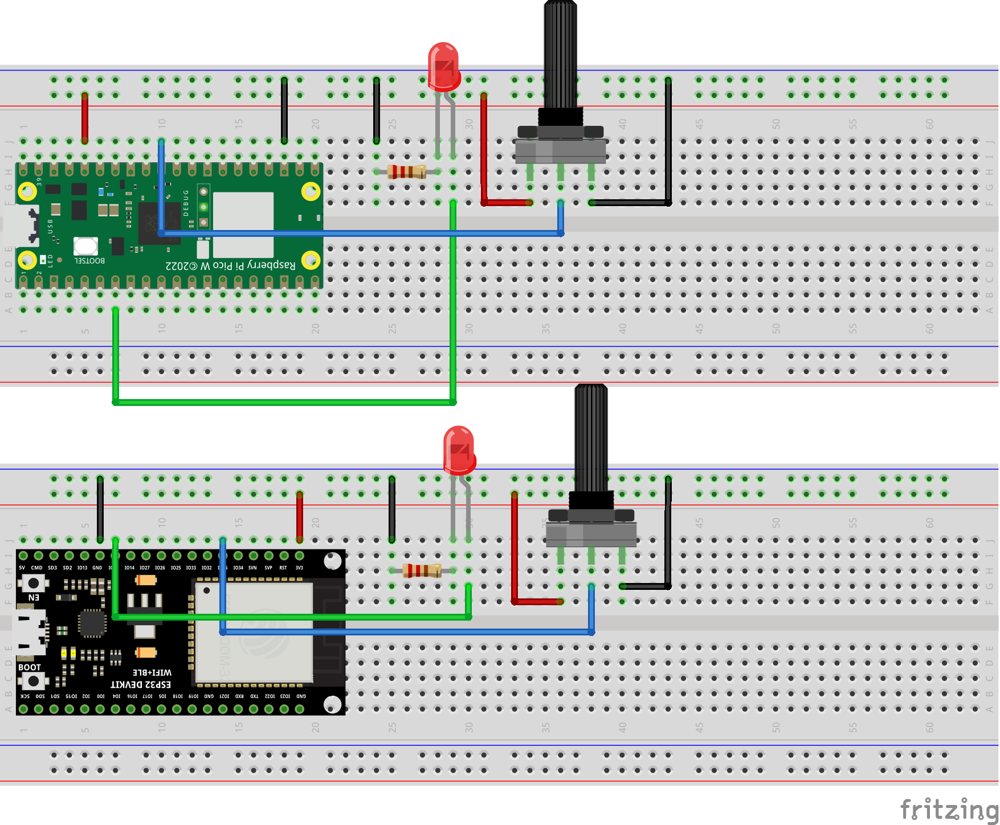

# MQTT Example

### Project details
- Raspberry Pi Pico and ESP32 used in this project
- shiftr.io used as MQTT Broker
- MQTT Explorer used in this project to show published values and publis values to devices

### Wiring Diagram of project: 
