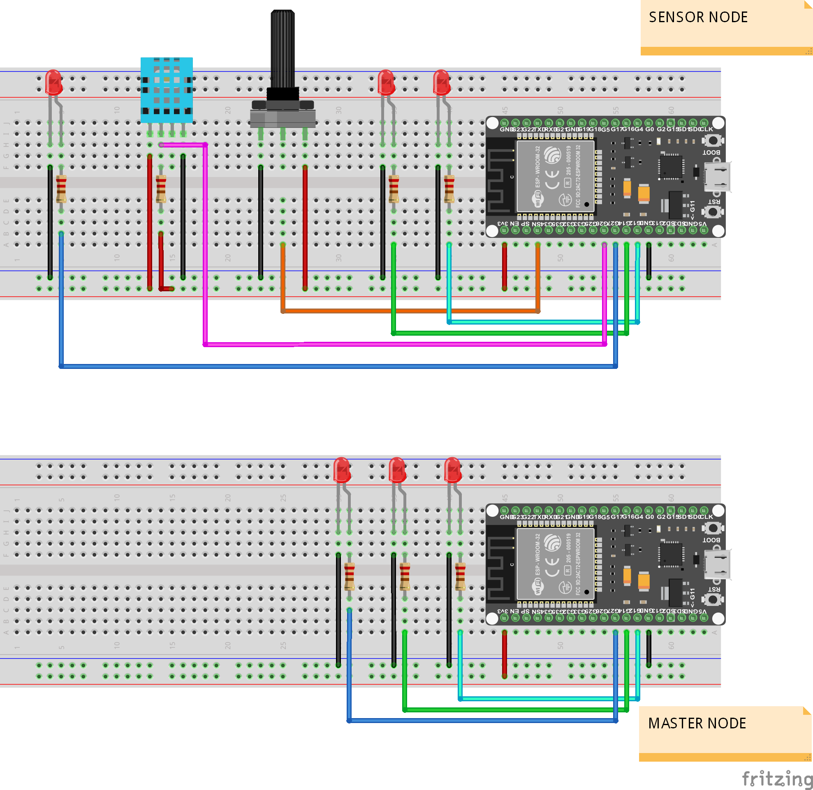

# ESP32 Communication Example With ESPNOW

### Master and Slave device communication example using ESP-NOW. Master device scans nearby slave devices which names are starting with 'Slave*' and pairs with it. Full article accessible from this link.

## Connection diagram of this project is given below

